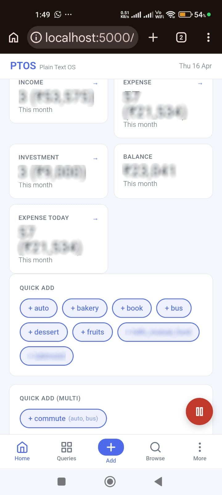
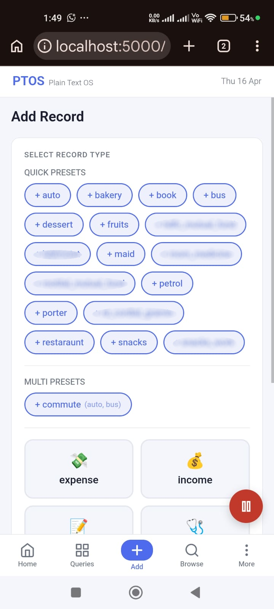
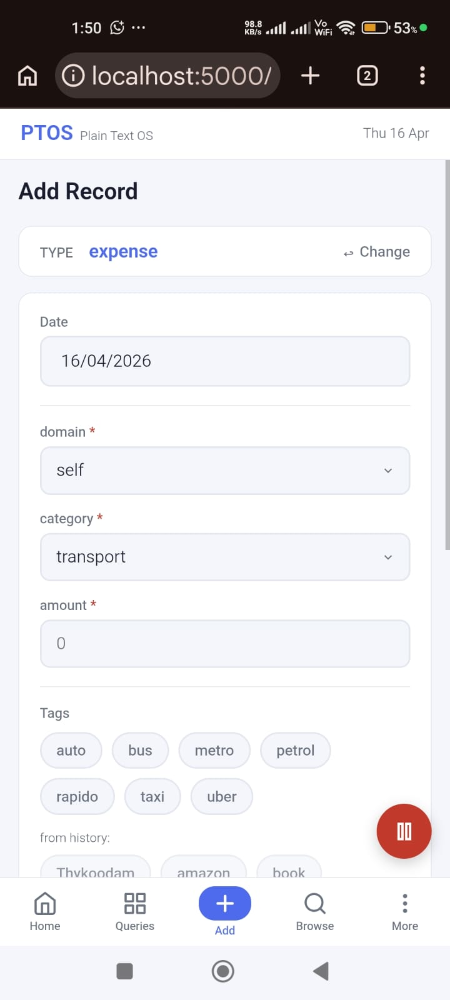
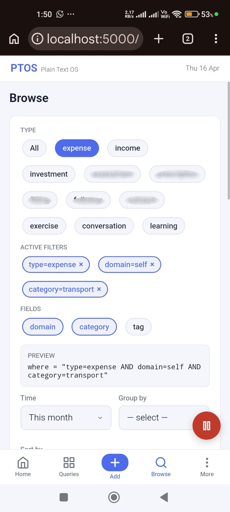
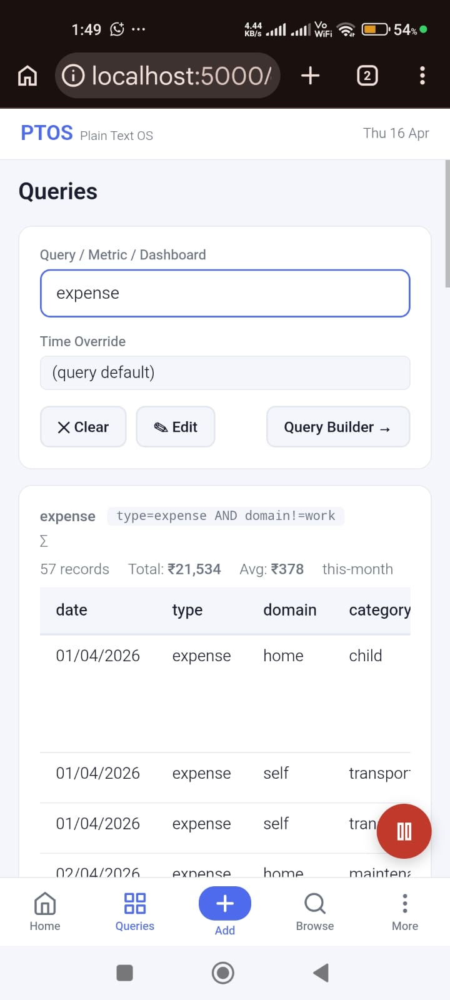

# PTOS — Plain Text Operating System

> **New to PTOS?** See [README_START_HERE.md](README_START_HERE.md) for a plain-English overview.

> Log it. Query it. Own it.

Record and analyse life, work, and finance events using structured plain-text logs.
No database. No cloud. You own the data completely.

---

## Table of Contents

### Getting Started
- [What it is](#what-it-is)
- [Requirements](#requirements)
- [Installation & Setup Scripts](#installation--setup-scripts)
- [Folder structure after init](#folder-structure-after-init)
- [Anatomy of a record](#anatomy-of-a-record)

### Web Interface (Primary)
- [Web Interface](#web-interface)
- [Pages reference](#pages-reference)
- [Schema Builder](#schema-builder)
- [Query Builder](#query-builder)
- [Settings](#settings)
- [Search](#search)
- [Backup & Restore](#backup--restore)

### Configuration
- [Configuration](#configuration)
- [Adding a new record type](#adding-a-new-record-type)
- [Unit labels in schema](#unit-labels-in-schema)
- [Queries reference](#queries-reference)
- [Presets reference](#presets-reference)

### Data Safety
- [Atomic Operations](#atomic-operations)
- [Doctor Command](#doctor-command)
- [Sharing and sync](#sharing-and-sync)
  - [Built-in OneDrive sync (rclone bisync)](#built-in-onedrive-sync-rclone-bisync)
  - [Git](#git)
  - [Syncthing / Dropbox / iCloud](#syncthing--dropbox--icloud)
- [Ignore patterns](#ignore-patterns)

### Advanced — CLI Reference
- [Quick start (CLI)](#quick-start-cli)
- [CLI reference](#cli-reference)
- [Time windows](#time-windows)
- [Filter expressions](#filter-expressions)
- [Table view](#table-view)
- [Derived fields](#derived-fields)
- [Trend analysis](#trend-analysis)
- [Due list](#due-list)
- [Exporting to CSV](#exporting-to-csv)
- [Summing a specific field](#summing-a-specific-field)
- [Reading from a specific file](#reading-from-a-specific-file)
- [Selecting output fields](#selecting-output-fields)
- [Analysis examples](#analysis-examples)
- [Validation](#validation)
- [Journal (CLI)](#journal-cli)

### Deployment
- [Server deployment (PythonAnywhere)](#server-deployment)

---

## What it is

Every event you record becomes one line in a plain-text `.log` file:

```
2026-03-10 type=expense domain=self category=food amount=120 tag=restaurant | lunch with team
2026-03-10 type=expense domain=self category=transport amount=90 tag=auto
2026-03-10 type=exercise activity=walk duration=30 tag=morning
```

Fields become dimensions for grouping and filtering. Numeric fields become measures for summing and averaging. All rules about what fields exist and what values they accept live in `schema.toml` — the engine has no domain logic of its own.

The web app is the primary interface. The CLI is the engine underneath — available for scripting, automation, and power use.

---

## Requirements

- Python 3.11+ (uses `tomllib` from the standard library)
- Flask and tomli-w for the web UI: `pip install flask tomli-w`
- Works on Windows, Linux, macOS, Android (Termux)

---

## Installation & Setup Scripts

**You only need to download the setup file(s) for your platform — they download
PTOS from GitHub, install dependencies, and create all config files automatically.**

### Windows

Single file — download and double-click:

[`run_ptos.bat`](https://raw.githubusercontent.com/godwinburby/ptos/main/run_ptos.bat)

The `.bat` downloads `run_ptos.ps1` automatically on first run,
then hands off to it. The `.ps1` does all the real work — Python/Git detection
and auto-install via `winget`, repo clone, Flask install, init, and server
launch. PowerShell ships by default on Windows 7+ — no extra install needed.

Or from PowerShell:
```powershell
curl -O https://raw.githubusercontent.com/godwinburby/ptos/main/run_ptos.bat
run_ptos.bat
```

### Linux / macOS

Single file — one script handles everything:

```bash
curl -O https://raw.githubusercontent.com/godwinburby/ptos/main/setup_ptos_linux.sh
bash setup_ptos_linux.sh
```

### Android / Termux

Single file — one script handles everything:

```bash
curl -O https://raw.githubusercontent.com/godwinburby/ptos/main/setup_ptos_android.sh
bash setup_ptos_android.sh
```

### What the setup script does

On first run, the script performs full setup:

1. Checks Python version (3.11+ required, auto-installs via `winget`)
2. Installs Git and rclone if missing (via `winget`)
3. Clones PTOS from GitHub via `git clone`
4. Installs Flask and tomli-w via pip
5. Runs `ptos --init` to create `config/`, `records/`, `journal/` and starter config files
6. Asks for your name and sets it in `config.toml`

On subsequent runs, it checks for updates (`git pull`) and starts the server.

On Android, setup installs code to `~/ptos` (Termux's native home, git-friendly)
and data to shared storage (`~/storage/shared/ptos-data`) — keeping them separate
for reliable git updates and Syncthing visibility.

On Windows and Linux, setup creates `ptos-data` as a sibling to the repo directory
(e.g. `~/ptos-data` next to `~/ptos`), keeping data outside the code repo and
away from OneDrive sync.

Safe to re-run — setup skips steps that are already done.

### Starting PTOS

Use the start script — it checks for updates on every launch:

| Platform | Command |
|----------|---------|
| Windows | `run_ptos.bat` |
| Linux / macOS | `bash start_ptos_linux.sh` |
| Android/Termux | `bash start_ptos_android.sh` |

### Alternative — git clone directly

If you already have git and prefer to manage things yourself:

```bash
git clone https://github.com/godwinburby/ptos.git
cd ptos
python ptos.py --init     # create config/ and starter files
python ptos_web.py        # start the web server
```

`--init` is safe to re-run — it will never overwrite existing config files.

To move data out of the repo (recommended for sync), use:

```bash
python ptos.py --set-home ~/ptos-data
```

---

## Folder structure after init

```
~/                                    # (or C:\Users\you)
├── ptos/                            # Code (git repo)
│   ├── ptos.py                      # Core engine
│   ├── ptos_cli.py                  # CLI argument parser
│   ├── ptos_service.py              # Service layer (web UI + CLI)
│   ├── ptos_web.py                  # Web UI (Flask)
│   ├── ptos_todo.py                 # Todo module
│   ├── .ptos_home                   # Points to ../ptos-data
│   ├── starters/                    # Default configs shipped with project
│   ├── tests/                       # pytest test suite
│   ├── web_templates/               # Jinja2 HTML templates
│   └── web_static/                  # CSS, JS, icons, PWA manifest
│
└── ptos-data/                       # Data (synced via rclone, outside OneDrive)
    ├── config/                      # User config (created by --init)
    │   ├── config.toml
    │   ├── schema.toml
    │   ├── queries.toml
    │   └── presets.toml
    ├── records/                     # Log files (YYYY.log)
    ├── exports/                     # CSV exports (created on demand)
    ├── todo/                        # Todo files (todo.txt, done.txt, done.YYYY.txt)
    ├── journal/                     # Markdown journal entries
    └── .ptos_sync_state             # Smart sync skip state

ptos-backups/                        # ZIP backups (sibling to ptos-data, outside sync scope)
```

On Android, data lives in `~/storage/shared/ptos-data` instead.

---

## Anatomy of a record

Every record follows this exact structure:

```
2026-03-11  type=expense  domain=self category=food amount=120  tag=restaurant  | lunch with team
──────────  ────────────  ──────────────────────────────────────  ─────────────  ────────────────
date        type          fields                                  tag(s)         note
```

| Part | Required | Description |
|------|----------|-------------|
| date | yes | `YYYY-MM-DD` — always first |
| type | yes | what kind of event — always second |
| fields | yes | `key=value` pairs defined by schema for this type |
| tag | recommended | freeform labels for cross-cutting queries — `tag=auto tag=bus` |
| note | recommended | human context after `\|` that fields cannot capture |

A record missing a tag or note is valid but weak — Lint will warn you.
A record missing a date or type is broken — Lint will error.

---

## Web Interface

`ptos_web.py` is a mobile-first Flask web app — the primary interface for all
day-to-day use. It shares all data and logic with the CLI through `ptos_service.py`.

The web app uses a service layer (`ptos_service.py`) between the Flask
frontend (`ptos_web.py`) and the core engine (`ptos.py`). This layer handles
record CRUD, bulk operations, dashboard orchestration, and structured API
responses for the web UI.

### Starting the web app

```bash
python ptos_web.py
```

Then open `http://localhost:5000` in your browser. For mobile access, use your
device's local IP (e.g. `http://192.168.1.x:5000`). The Android/Termux start script
opens the browser automatically.

### Files

| File | Purpose |
|------|---------|
| `ptos_web.py` | Flask application |
| `ptos_service.py` | Service layer — shared data access for web and CLI |
| `web_templates/` | HTML templates |

---

## Pages reference

### Home

Dashboard stats (first 4 metrics from the configured dashboard), overdue due-list
summary (up to 5 rows), quick-add preset buttons, and today's records. A dropdown
lets you switch between dashboards. The default dashboard is set in `config.toml`
under `[dashboard] default`.

Features:
- Personalized greeting with user name
- Dashboard selector dropdown
- Time window selector (presets + specific year/month/date/range)
- Quick-add preset chips and multi-record preset buttons
- Overdue items with heat indicators (hot / warm / cool)
- Today's records table with inline edit/delete
- **Table column sorting** — click headers to sort



### + Add Record

Schema-driven add form. Select a record type and all required and optional fields
appear automatically. Features:

- Dropdowns for fields with defined options
- Conditional fields that appear/disappear based on other field values
- Numeric fields with unit labels (e.g. `₹`, `min`)
- Tag checkboxes plus a custom tags field
- Preset loading — pick a preset from a dropdown to pre-fill the form
- Save as Preset — fill the form, click Save as Preset, name it, done
- Frequent presets — most-used presets shown at the top with a "show all" toggle
- Multi-record presets — add a group of related records in one tap
- History-based defaults — most common values for option fields are pre-selected
- Cascade suggestions — picking a field value (e.g. `source=mgm`) suggests the
  most common co-occurring values for related fields. Purely history-driven — no
  config needed. PTOS scans past records of the same type that share the chosen
  value and pre-selects the most frequent value for every other option field.
- Log Editor inline validation — the editor highlights parse errors as you type
  without needing to save first

 

### Browse

Filter, search, and group records. Features:
- Type selector and time window (presets + specific year/month/date/range)
- **Chip-based filter builder** with active filter display
- Free-text expression filter (full boolean syntax: `AND`, `OR`, `NOT`, parentheses)
- Free-text search with debounced auto-search (supports glob wildcards: `*` and `?`)
- Group by field
- Sort by field
- Specific log file selection
- **Bulk operations** — multi-select rows, bulk edit/delete
- **Table column sorting** — click headers to sort
- Inline edit and delete for each result row
- **Save as Query dialog** for naming queries
- Export current results to CSV



### Queries

Run any named query, metric, or dashboard from `queries.toml`. Choose a query from
the list, optionally override the time window, and run. Results render inline:
records as a table, groups as a summary, metrics as a value, dashboards as a card grid.



### Due

Overdue record list with heat indicators (hot / warm / cool) based on days since
last contact. Days threshold can be adjusted on the page.

### Journal

Daily markdown journal editor. Opens today's journal. Navigate to previous or future
dates; forward navigation is blocked past today. Creates a new entry from template
for dates with no file. Autosaves after 2.5 seconds of inactivity. Saves with a
`.bak` backup automatically.

### Search

Universal search across records, journal entries, and todos. Type a query in the
topbar search field and press Enter or click the magnifying glass. Results are
grouped by category — click any result to jump directly to it. Supports glob
wildcards (`*` and `?`) for pattern matching. Searches record values, journal
file names, and todo descriptions.

### Todo

Plain-text task manager using the [todo.txt](http://todotxt.org/) format. Tasks live
in `todo/todo.txt`, completed tasks move to `todo/done.txt`.

**Features:**
- Overdue / Today / Upcoming / Someday sections with collapsible Done section
- Priority badges (A=red, B=orange, C=blue, D=gray), due date badges, project/context chips
- Quick-add text input with todo.txt syntax (`(A) Task +Project @context due:tomorrow`)
- **Autocomplete** — type `+s` to suggest `+service`, `@c` for `@clinic`, `due:t` for `due:today`, `t:t` for `t:today`, `(a` for `(A)`. Arrow keys + Enter to select.
- **Quick pick chips** (collapsible) — click Due, Priority, Projects, Contexts, or Threshold chips to insert into input. Due/Threshold include `this_week`, `next_week`, `this_month`, `next_month` shortcuts. On mobile, groups stack vertically instead of scrolling
- **Filter chips** (collapsible) — filter by Priority (A-D), Due Range (overdue/today/upcoming/someday/none), and Context. Click a chip to toggle filter on/off. On mobile, groups stack vertically
- **Search** (always visible) — text input with glob wildcard `*`/`?` support; type a term and press Search or Enter to filter todos by description
- **Clickable todo chips** — click project, context, or priority chips on any todo row to filter the list; click again to remove filter
- **Form modal** (press `n` or click `+`) — Priority as dropdown (None/A/B/C/D), Projects and Contexts as clickable toggle chips with "+ New" for adding new ones
- Inline edit (pencil icon on hover) and delete for open and done tasks; done tasks also support undo (checkmark) to move back to todo.txt
- Project rail for filtering by `+Project` with toggle behavior
- Collapsible `? Help` reference card
- **System notifications** — native OS desktop notifications (Linux: `notify-send`, macOS: Notification Center, Windows: toast, Android: `termux-notification`) alongside browser notifications; works in PWA mode (service worker excludes SSE endpoint)
- Automatic archiving: done items older than 6 months move to `done.YYYY.txt` on startup


**Todo.txt format reference:**
```
(A) Call supplier +HearSpeechPro @phone due:tomorrow 3pm
```
| Part | Description |
|------|-------------|
| `(A)` | Priority A-D. Or type `pri:a` |
| `+Project` | Project tag (e.g. `+Home`, `+HearSpeechPro`) |
| `@context` | Context tag (e.g. `@phone`, `@errand`) |
| `due:date` | Due date — `today`, `tomorrow`, `fri`, `due:this_week`, `due:next_month`, `+3d`, `2026-07-12` |
| `t:date` | Threshold date (surfaces when it arrives) |
| `due:date time` | With time — `due:tomorrow 3pm`, `due:2026-07-12T14:30` |

**Keyboard shortcuts:**
- `G` `T` — navigate to Todo page
- `n` — open add form modal (when not in an input)
- `Enter` — submit (in input with autocomplete, or in modal)
- `Arrow Up`/`Down` — navigate autocomplete suggestions
- `Escape` — close modal or autocomplete dropdown

### Log Editor

View and edit any `.log` file in `records/` directly in the browser. File selector
dropdown at the top. Saves with a `.bak` backup before every write. Use this only
to correct a record that can't be fixed through Browse → Edit.

### Schema Builder

Visual editor for `schema.toml`. Add, edit, and delete record types; define fields,
types, and conditions. See [Adding a new record type](#adding-a-new-record-type).

### Backup

Create full or config-only backups, download existing backups, restore from a local
backup or uploaded ZIP file, delete old backups, and export a filtered schema bundle
for sharing. See [Backup & Restore](#backup--restore).

### Query Builder

Visual builder for creating queries, metrics, and dashboards. Features:
- **Multi-section interface** (Queries/Metrics/Dashboards)
- Type → field → value chip-based workflow
- Tags section with schema-defined and historical tags
- **WHERE expression builder with chips**
- **Live records preview** (auto-updates as you build)
- Advanced WHERE mode for raw expression editing
- Granular time window (specific year, month, date, or date range) with month picker popup
- **Dashboard editor** for managing dashboard metrics (drag-and-drop reorder items)
- Save as Query or Metric

### Settings

Configure user profile and app preferences. Sections:

- **Profile**: user name
- **Display**: currency symbol, date format (with live examples)
- **Dashboard**: default dashboard selection
- **Custom Cycles**: CRUD for billing cycles (day 1-31)
- **Backup Folders**: core folders locked, custom folders editable
- **Backup Settings**: auto backup on startup/shutdown triggers
- **Todo**: reminder check interval (minutes) — how often PTOS checks for due todos; takes effect after restart
- **Sync**: OneDrive bidirectional sync via rclone bisync. See [Sync section](#sharing-and-sync) for full details.

Settings are stored in `config.toml` and editable via the UI.

### Keyboard Shortcuts

Press `?` from any page to view all shortcuts. Navigation uses a two-key chord: press `G` then the second key within 1.5 seconds.

**Navigation:**
| Shortcut | Page |
|----------|------|
| `G` `H` | [Home](#home) |
| `G` `A` | [+ Add Record](#-add-record) |
| `G` `B` | [Browse](#browse) |
| `G` `Q` | [Queries](#queries) |
| `G` `U` | [Query Builder](#query-builder) |
| `G` `J` | [Journal](#journal) |
| `G` `D` | [Due](#due) |
| `G` `E` | [Log Editor](#log-editor) |
| `G` `L` | [Lint](#lint) |
| `G` `S` | [Settings](#settings) |
| `G` `C` | [Schema Builder](#schema-builder) |
| `G` `K` | [Backup](#backup--restore) |
| `G` `F` | [Search](#search) |

**Actions:**
| Shortcut | Action |
|----------|--------|
| `?` | Show help overlay |
| `Esc` | Close overlay / cancel |
| `/` | Focus search/filter (Browse page, sidebar search) |
| `Ctrl+K` | Focus topbar search (any page) |
| `N` | New record (same as `G` `A`) |
| `E` | New expense |
| `I` | New income |
| `T` | New investment |

### Lint

Run validation on all records against the schema. Results show errors, warnings, and
quality notes grouped by severity. Each issue links to the Log Editor at the exact line.

---

## Schema Builder

Navigate to the **Schema Builder** tab in the web app to:

- Add, edit, and delete record types
- Define required and optional fields per type
- Set field types (text, int, options)
- Configure conditional fields and tags
- Drag-and-drop reorder field options, shared options, and chips

No need to edit `schema.toml` directly for most changes.

### Manual schema editing

For advanced changes or bulk edits, edit `schema.toml` directly:

1. Add the type name to `[types] allowed`
2. Define `required`, `fields`, and optionally `tags` and `conditions`
3. Run Lint (web UI) or `ptos --lint` (CLI) to verify existing records still pass
4. Optionally add saved queries in `queries.toml` and presets in `presets.toml`

```toml
# schema.toml

[types]
allowed = [..., "mood"]

[type.mood]
required = ["rating", "context"]

[type.mood.fields.rating]
options = ["1", "2", "3", "4", "5"]

[type.mood.fields.context]
options = ["work", "home", "social", "health", "travel"]
```

---

## Backup & Restore

### Web UI (recommended)

Access the **Backup** tab:

- Create full or config-only backups
- Download any backup
- Restore from a local backup or uploaded ZIP file
- Delete old backups
- **Share Schema** — export a filtered bundle of schema, queries, presets, and config as a ZIP. Select which record types to include; queries, metrics, dashboards, and presets are filtered automatically. Downloaded as `ptos-schema-share-YYYYMMDD_HHMMSS.zip`

### CLI

```bash
ptos --backup-full    # Full backup: records/, templates/, config/, journal/
ptos --backup-config  # Config-only backup: schema, queries, presets, config
```

### Backup retention

- **Full backups:** Keeps the last **10 backups** automatically. Older ones are
  deleted after each new backup.
- **Config backups:** Keeps the last **10 backups** by default (configurable via
  `max_config_backups` in `config.toml`).

### Backup files

Stored in `ptos-backups/` (sibling to `ptos-data`, outside sync scope) with timestamped names:
- Full: `ptos-backup-full-YYYYMMDD_HHMMSS.zip`
- Config: `ptos-backup-config-YYYYMMDD_HHMMSS.zip`

---

## Configuration

All configuration lives in `config.toml`. Most settings can be edited via the **Settings** page in the web app.

### Starter configs (`starters/`)

When you run `--init` (or the setup script), PTOS copies default configs from
`starters/` into `config/`. These starter files ship with the project — edit
the copies in `config/`, not the originals. If you delete `config/` and re-init,
the starters are used again.

**Starter files:**

| File | Contents |
|------|----------|
| `starter_config.toml` | User, editor, display, cycles, dashboard, auth, backup, todo settings |
| `starter_schema.toml` | 7 record types: expense, income, investment, exercise, sleep, mood, learning — with parent-dependent fields, tags, global optional fields (context, project) |
| `starter_queries.toml` | 15 base queries + 6 metrics (savings_rate, food_ratio, avg_spend, total_income, total_expenses, avg_mood) + 2 dashboards (default, health) |
| `starter_presets.toml` | 21 presets with short aliases — coffee, lunch, dinner, groceries, restaurant, auto, bus, metro, petrol, rapido, recharge, broadband, electricity, salary, sip, rd, walk, gym, run, read, course |

### config.toml

```toml
[user]
name = "Your Name"           # displayed on dashboard

[editor]
command = "nvim"            # falls back to $EDITOR, then notepad/nvim by OS

[display]
currency = "₹"              # prefix shown on all numeric output
date_format = "DD/MM/YYYY"   # displayed on home page with live example

[cycles]
billing_cycle = 26           # billing cycle day (1-31)
# Add more cycles: billing_cycle = [26, 15]

[dashboard]
default = "monthly"          # default dashboard shown on web UI home page

[backup]
auto_backup_on_startup  = true   # auto backup when web server starts
auto_backup_on_shutdown = true   # auto backup when web server stops
backup_if_files_changed = true   # skip backup if files unchanged since last backup
max_full_backups        = 10     # keep last N full backups
max_config_backups      = 10     # keep last N config-only backups
folders = ["records", "config", "templates", "journal", "notes"]

[sync]
enabled                 = true   # enable/disable all sync paths
remote_name             = ""     # rclone remote name (configure in Settings)
remote_path             = ""     # remote folder path
folders                 = ["config", "records", "journal", "todo"]
auto_sync_on_startup    = false
auto_sync_on_shutdown   = false
sync_interval_minutes   = 0      # periodic sync interval (0 = disabled)

[todo]
notify_interval         = 5      # background due-todo check interval (minutes)
archive_months          = 6      # months before done items are archived

# Optional — HTTP Basic Auth for server deployments (e.g. PythonAnywhere)
# Without this anyone who knows the URL can access your data.
[auth]
username = "yourname"
password = "yourpassword"
```

### PTOS_HOME — separating code from data

By default PTOS keeps everything (code + data) in one folder. Use `PTOS_HOME` to
point code to data in a different location — useful when code is git-synced and
data lives in a cloud-synced folder.

**One-time setup:**

```bash
# Set the env var to your data directory
export PTOS_HOME=/data/ptos       # Linux / macOS / Termux
set PTOS_HOME=D:\Data\ptos-data   # Windows

# Run init to create directory structure and persist the path
python ptos.py --init
```

After `--init`, PTOS writes a `.ptos_home` file next to `ptos.py` containing the
resolved data path. The env var is no longer needed — PTOS reads `.ptos_home` on
every launch.

Priority: `PTOS_HOME` env var > `{script_dir}/.ptos_home` > data next to code.

The setup scripts handle this automatically: they create `ptos-data/` as a sibling
to the repo directory and write `.ptos_home` before running `--init`.

---

## Adding a new record type

Preferred: use the **Schema Builder** tab in the web app (visual, no file editing).

For manual editing, see the [Schema Builder](#schema-builder) section above.

Example full type definition with a saved query and preset:

```toml
# schema.toml
[types]
allowed = [..., "mood"]

[type.mood]
required = ["rating", "context"]

[type.mood.fields.rating]
options = ["1", "2", "3", "4", "5"]

[type.mood.fields.context]
options = ["work", "home", "social", "health", "travel"]
```

```toml
# queries.toml
[mood_today]
where = "type=mood"
time  = "today"
```

---

## Unit labels in schema

To show a unit hint next to a numeric field in the web UI add forms:

```toml
[fields.amount]
type         = "int"
dimension    = false
aggregatable = true
unit         = "₹"

[fields.duration]
type         = "int"
dimension    = false
aggregatable = true
unit         = "min"
```

The `unit` key is read by the web UI only — `ptos.py` ignores it.

---

## Queries reference

### Base queries — reusable filters

```toml
[expenses]
where = "type=expense"

[food]
where = "type=expense category=food"
```

### Metrics — computed over base queries

```toml
[metrics.food_ratio]
ratio = ["food", "expenses"]     # food spend as % of total expenses

[metrics.avg_spend]
avg = "expenses"                 # average amount per record

[metrics.total_spend]
sum = "expenses"                 # total amount across matched records

[metrics.highest_spend]
max = "expenses"                 # highest single record

[metrics.lowest_spend]
min = "expenses"                 # lowest single record
```

`avg` also supports weighted averaging — useful when records represent different unit counts:

```toml
[metrics.avg_expense]
avg          = "expenses_this_month"
unit_field   = "category"
unit_weights = { food = 1, transport = 2 }
```

### Derived metrics — arithmetic over other metrics and base queries
```toml
[metrics.balance]
derived = "income_this_month - expenses_this_month"

[metrics.savings_rate]
derived = "balance / income_this_month * 100"
```

Tokens in the expression can be other metrics or base queries directly. Base queries
used in derived metrics yield their numeric total. The base query's own time window
applies when it has one defined.

### Special tokens for date/day arithmetic

In addition to other metrics and base queries, derived metrics support these
special tokens (automatically available in the expression context):

| Token | Description | Example |
|-------|-------------|---------|
| `cycle_day` | Days elapsed since cycle start (1-indexed) | Day 5 of a 26th-starting cycle |
| `cycle_days` | Total days in current cycle | 30 (varies by month) |
| `month_day` | Day of month (1-31) | 30 |
| `month_days` | Total days in current month | 30 |

These use the first cycle defined in `config.toml` `[cycles]` section, falling
back to month-based calculation if no cycle is defined.

Example:
```toml
[metrics.snacks_daily_quota]
derived = "(1200 - snacks_work) / (cycle_days - cycle_day)"
time = "clinic"
```

### Dashboards — named collections of metrics and queries

```toml
[dashboards.monthly]
metrics = ["expenses_this_month", "income_this_month", "balance", "savings_rate"]
```

### Saved queries — any combination of filters, time, and analysis

```toml
[monthly_expenses]
where = "type=expense"
time  = "this-month"
sum   = true

[income_by_source]
where = "type=income"
time  = "this-month"
group = "source"

[exp_cat]
where = "type=expense"
time  = "this-month"
group = "category"
group = ["category"]

[sales_trend]
where = "type=sale"
time  = "this-month"
trend = 6
```

---

## Presets reference

Shortcuts for entries you add frequently. Any field can be omitted — PTOS will prompt
for it (CLI) or leave it blank (web form).

```toml
[presets.commute]
type     = "expense"
domain   = "self"
category = "transport"
amount   = 90
tag      = ["auto"]

[presets.snacks]
type     = "expense"
domain   = "work"
category = "staff_welfare"
tag      = ["snacks"]
# amount omitted — will be prompted each time
```

### Preset aliases

```toml
[presets.c]
alias = "commute"    # ptos -p c  runs the commute preset
```

### Multi-record presets

```toml
[presets.morning]
records = [
  { type = "exercise", activity = "walk", duration = "30", tag = ["morning"] },
  { type = "learning", topic = "stoicism", source = "podcast", domain = "self" },
]
```

---

## Atomic Operations

PTOS ensures data safety through atomic write operations at every level.

### File writes (`.bak` + `.tmp` pattern)

Every write operation follows this sequence:
1. Copy current file to `*.bak`
2. Write new content to `*.tmp`
3. Atomic rename `.tmp` → final file
4. On success: delete `.bak`
5. On failure: restore from `.bak`, delete `.bak`

This applies to adding records, editing records, saving presets, saving journal
entries, and Log Editor saves.

### Backup creation (`.tmp` + verify pattern)

1. Write backup to `*.tmp` file
2. Verify ZIP integrity with `testzip()`
3. Atomic rename `.tmp` → final `.zip`
4. Clean up old backups if limit exceeded

### Restore operations (pre-restore backup + `.bak` pattern)

1. Create a full backup before restore (safety net)
2. Extract new files to temp directory
3. Copy existing folders to `*.bak`
4. Copy new files from temp to destination
5. On success: delete all `*.bak` backups
6. On failure: restore from `*.bak` backups

### Crash safety

If PTOS crashes mid-write, the original file is preserved (still in `.bak`),
the incomplete `.tmp` is cleaned up, and on next run PTOS restores from `.bak`.

Add `*.bak` and `*.tmp` to your `.gitignore` and Syncthing ignore patterns.

---

## Doctor Command

```bash
ptos --doctor           # Check for issues
ptos --doctor --fix     # Auto-fix issues where possible
```

Health checks after every AI-assisted session, before trusting the result:

1. **TOML syntax** — parses schema, queries, presets, config files
2. **Config shape** — warns if schema has no `type="int"` fields (metrics
   will silently show "no data")
3. **`.ptos_home` sanity** — catches temp-path or missing-path corruption
4. **Data sanity** — flags 0-byte log files (possible data loss) and empty
   config/todo directories
5. **Install completeness** — Python version, Flask, required folders/files

---

## Sharing and sync

Records are plain text — one line per entry, one file per year. Multiple
devices can safely append to the same log file as long as writes don't overlap.

### Built-in OneDrive sync (rclone bisync)

PTOS has built-in bidirectional sync with OneDrive using
[rclone bisync](https://rclone.org/). Enable it in **Settings → Sync**.

**Platform support:**
- **Linux / macOS / Termux / Windows**: Full support. Requires rclone installed and configured
  with a remote.

**Web UI controls:**
- **Enable/disable toggle** — turns periodic sync on and off
- **Remote name and path** — rclone remote name (e.g. `onedrive`) and remote
  folder path
- **Folder checkboxes** — select which data folders to sync (e.g. `records/`,
  `config/`, `journal/`, `todo/`)
- **Sync Now** — trigger an immediate sync
- **Force Resync** — discard rclone's sync history and start fresh (for
  fixing sync conflicts or state corruption)

**Status indicator:** The sidebar shows a colored dot reflecting sync state:
- Gray: idle
- Blue with pulse animation: running
- Green: OK (last sync succeeded)
- Orange: conflict detected
- Red: error

**SSE events:** The web UI receives `sync-start` and `sync-done` SSE events
in real time. `sync-start` triggers the dot pulse animation; `sync-done`
updates the dot color (green for success, red for error) and clears after 10s.
Periodic syncs also broadcast these events so the browser reflects background
sync activity. Manual UI syncs additionally stream rclone output line-by-line
via `sync-log` events to the Settings output panel.

**Change detection (smart skip):** Periodic sync checks local file mtimes
and sizes against `.ptos_sync_state` before calling rclone. If no local files
changed since the last successful sync, rclone is skipped entirely — saving
network, CPU, and battery. Manual sync (UI button), startup, and shutdown
syncs always run regardless. If another device pushes changes while your
local side is quiet, those changes are pulled the next time you make a
local edit and sync.

**Concurrency:** A PID-based file lock (`.sync.lock`) prevents overlapping
sync runs across processes (web + CLI + cron). If a sync is already in
progress, new requests are rejected with a clear error.

**Configuration in `config.toml`:**
```toml
[sync]
enabled = true           # enable/disable all sync paths
remote_name = "onedrive" # rclone remote name
remote_path = "ptos"     # remote folder path
folders = ["config", "records", "journal", "todo"]
auto_sync_on_startup = false
auto_sync_on_shutdown = false
sync_interval_minutes = 0   # periodic sync (0 = disabled)
```

### Git

Commit `records/` after each session. Full history, diff-friendly.

### Syncthing / Dropbox / iCloud

Sync the whole `ptos-data/` folder. On Android, data lives in
`$HOME/storage/shared/ptos-data` — visible to Syncthing and file managers.

---

## Ignore patterns

Add to `.gitignore` and Syncthing ignore patterns:

```
*.tmp
*.bak
ptos_error.log
```

---

---

# Advanced — CLI Reference

The CLI is `ptos.py` — the engine that powers the web app. Use it directly for
scripting, automation, bulk analysis, or terminal-only environments.

---

## Quick start (CLI)

```bash
# Initialise (first time only if not using setup script)
python ptos.py --init

# Optional: add an alias
alias ptos="python ~/ptos/ptos.py"

# Add a record
ptos --add type=expense domain=self category=food amount=120

# Add with a specific date
ptos --add type=expense domain=self category=food amount=120 --date yesterday
ptos --add type=expense domain=self category=food amount=120 --date 2026-03-08

# Use a preset
ptos --preset commute
ptos --preset commute --date yesterday

# Interactive add
ptos --add

# Run a saved query
ptos --query monthly_expenses
ptos --query monthly_expenses --time last-month

# Open today's journal
ptos --journal

# Edit config files
ptos --edit s        # schema.toml
ptos --edit q        # queries.toml
ptos --edit c        # config.toml
ptos --edit p        # presets.toml
ptos --edit r        # this year's records log
ptos --edit d        # today's journal
```

---

## CLI reference

### Add

| Flag | Short | Description |
|------|-------|-------------|
| `--add [field=value ...]` | `-a` | Add a record. No arguments = interactive mode |
| `--note "note text"` | `-n` | Attach a note to the record |
| `--date DATE` | `-d` | Date for the record. Accepts `YYYY-MM-DD`, `today`, `yesterday` (default: today) |
| `--preset [name] [field=value ...]` | `-p` | Quick-add from preset. Override fields inline |
| `--save-preset NAME` | | Save the record being added as a preset under this name |
| `--delete-preset NAME` | | Delete a preset by name from `presets.toml` |

### Query

| Flag | Short | Description |
|------|-------|-------------|
| `--query [name]` | `-q` | Run a saved query. No name = list all queries, metrics, dashboards |
| `--where expr ...` | `-w` | Filter expressions. Simple: `field=value`. Boolean: `"field=a AND field!=b"` |
| `--time TIME` | `-t` | Time window (see below). Accepts: `td/yd/tw/lw/tm/lm/tq/lq/ty/ly`, `YYYY`, `YYYY-MM`, `YYYY-MM-DD`. Default: `this-month` |
| `--from YYYY-MM-DD / YYYY-MM / YYYY` | `-f` | Start date (use with `--to` for custom ranges) |
| `--to YYYY-MM-DD / YYYY-MM / YYYY` | `-T` | End date |
| `--type TYPE` | `-y` | Filter by record type |
| `--tag TAG` | `-g` | Filter by tag (repeatable: `--tag auto --tag bus`) |
| `--search text` | `-S` | Full-text search |
| `--save NAME` | | Save current query filters and analysis to `queries.toml` under that name |

```bash
# Save a query for reuse
ptos --where type=expense --group category --time tm --save monthly_by_cat
ptos --query monthly_by_cat                    # run it any time after
ptos --query monthly_by_cat --time last-month  # override time at run time

# Custom date ranges (accepts YYYY-MM-DD, YYYY-MM, or YYYY)
ptos --where type=expense --from 2026-01-01 --to 2026-03-31
ptos --where type=expense --from 2026-01 --to 2026-03           # YYYY-MM expands to 1st/last of month
ptos --where type=expense --from 2026 --to 2026                  # full year
ptos --where type=expense --from 2026-01-01 --to 2026-03-31 --table
ptos --where type=expense --from 2026-01-01 --to 2026-03-31 --export q1_spend
```
| `--file FILENAME` | | Read from a specific file in `records/` (e.g. `2025.log`) |
| `--select field ...` | | Show only specified fields. Date, type always included; add `note` to include notes |

### Analyse

| Flag | Short | Description |
|------|-------|-------------|
| `--group field [field ...]` | `-G` | Group by one or more fields. Virtual fields: `day` (YYYY-MM-DD), `month` (YYYY-MM), `year` |
| `--group ?` | | Discover available group fields for current results |
| `--pivot ROW COL` | `-v` | Pivot table |
| `--pivot ?` | | Discover available pivot fields |
| `--count` | | Count records instead of summing numeric fields. Works with `--group` and `--pivot` |
| `--sort COL` | | Sort results or pivot rows by a column |
| `--sum-field FIELD` | | Sum a specific numeric field instead of auto-detecting |
| `--trend [N]` | | Show last N periods side by side (default: 6) |
| `--due [NAME\|DAYS]` | | Show overdue records. Optional: named due config or days override |
| `--table` | | Display results as a formatted table instead of raw lines |
| `--export [FILENAME]` | | Export to CSV in `exports/`. Auto-named if no filename given |
| `--fields` | | Field discovery report for current results |

### Edit / Delete

| Flag | Description |
|------|-------------|
| `--set key=value ...` | Edit matched records. Shows diff and asks for confirmation |
| `--set key+=value` | Append a value to a list field (e.g. add a tag) |
| `--set key-=value` | Remove a value from a list field |
| `--set key=` | Delete a field entirely (empty value) |
| `--set date=YYYY-MM-DD` | Change the date — moves record to the correct year file automatically |
| `--set-note "text"` | Replace the note on matched records |
| `--delete` | Delete matched records |
| `--all` | Apply `--set` or `--delete` to all matched records without interactive pick |

`--set` and `--delete` require at least one filter (`--where`, `--type`, or `--tag`).
When multiple records match and `--all` is not given, PTOS lists them and asks you to
pick by number.

```bash
# Fix a typo in a field
ptos -y expense -t td --set category=food

# Add a tag to a specific record
ptos -w "type=expense domain=self" -t td --set tag+=urgent

# Add a tag to all expenses
ptos -y expense -t tm --set tag+=tracked

# Change the date of a record (moves to correct year file if needed)
ptos -w "type=expense amount=120" --set date=2026-03-15

# Replace the note
ptos -y expense -t td --set-note "corrected note here"

# Delete all of today's test records
ptos -y test -t td --delete --all
```

### Utilities

| Flag | Short | Description |
|------|-------|-------------|
| `--lint` | `-l` | Lint all records against schema |
| `--lint --fix` | | Open each log file that has errors in the editor after linting |
| `--journal` | `-j` | Open today's journal (creates from template if new) |
| `--edit [TARGET]` | `-e` | Edit a workspace file (see targets below) |
| `--init` | | Initialise workspace (safe to re-run — will not overwrite existing files) |
| `--set-home PATH` | | Point PTOS at a data folder (writes `.ptos_home`, migrates existing data) |
| `--bisync` | | Bidirectional sync with remote (reads `[sync]` from config.toml) |
| `--sync` | | One-way push to remote (DELETES remote files not present locally — requires `--confirm-delete`) |
| `--confirm-delete` | | Required alongside `--sync` to acknowledge remote file deletions |
| `--resync` | | With `--bisync`: initialize bisync relationship (first-time setup) |
| `--backup-full` | | Create full backup (records/, config/, templates/, journal/) |
| `--backup-config` | | Create config-only backup (schema, queries, presets, config) |
| `--restore-full [PATH]` | | Restore from full backup. Shows interactive list if no path given |
| `--restore-config [PATH]` | | Restore from config-only backup. Shows interactive list if no path given |
| `--list-backups` | | List all available backups in `ptos-backups/` |
| `--delete-preset NAME` | | Delete a preset by name from `presets.toml` |
| `--set-name NAME` | | Set user name in `config.toml` |
| `--set-date-format FORMAT` | | Set date display format: `indian` `us` `eu` `readable` `iso` or custom strftime |
| `--todo-add [text]` | | Add a todo. Preprocesses pri:/due:/t: shortcuts |
| `--todo-list` | | List open todos with bucket grouping |
| `--todo-done N` | | Mark todo at line N complete |
| `--todo-edit N key=value` | | Edit a field on a todo |
| `--todo-delete N` | | Delete a todo by line number |
| `--doctor` | | Check PTOS installation health |
| `--doctor --fix` | | Auto-fix issues found by --doctor |
| `--check-schema` | | Validate schema.toml structure (missing types, bad refs, unknown field types) |

### `--edit` targets

| Target | File opened |
|--------|-------------|
| `r` | This year's records log (`records/YYYY.log`) |
| `s` | `config/schema.toml` |
| `q` | `config/queries.toml` |
| `c` | `config/config.toml` |
| `p` | `config/presets.toml` |
| `d` or `j` | Today's journal |
| `x` | `ptos.py` itself (the engine script) |

```bash
ptos --edit s        # open schema.toml
ptos --edit q        # open queries.toml
ptos --edit c        # open config.toml
ptos --edit p        # open presets.toml
ptos --edit r        # open this year's records log
ptos --edit d        # open today's journal
```

### Config shortcuts

```bash
ptos --set-name "Godwin"                   # update name in config.toml
ptos --set-date-format indian              # DD-Mon-YYYY e.g. 02-Jun-2026
ptos --set-date-format us                  # MM/DD/YYYY
ptos --set-date-format iso                 # YYYY-MM-DD
ptos --set-date-format "%d %B %Y"         # custom strftime: 02 June 2026
```

### Backup and restore

```bash
ptos --backup-full                         # create full backup
ptos --backup-config                       # create config-only backup
ptos --list-backups                        # list all backups
ptos --restore-full                        # interactive list to pick from
ptos --restore-full ptos-backups/ptos-backup-full-20260602_100000.zip
ptos --restore-config                      # interactive list to pick from
```

### Query saving

```bash
# Run a query and save it for reuse
ptos --where type=expense --group category --time tm --save monthly_by_cat

# Custom date range (accepts YYYY-MM-DD or YYYY-MM)
ptos --where type=expense --from 2026-01-01 --to 2026-03-31
ptos --where type=expense --from 2026-01 --to 2026-03
ptos --where type=expense --from 2026-01-01 --to 2026-03-31 --table
```

---

## Time windows

| Keyword | Range |
|---------|-------|
| `today` | Today only |
| `yesterday` | Yesterday only |
| `this-week` | Monday to Sunday |
| `last-week` | Previous Monday to Sunday |
| `this-month` | 1st to last day of current month |
| `last-month` | Previous calendar month |
| `this-quarter` | Current calendar quarter |
| `last-quarter` | Previous calendar quarter |
| `this-year` | Jan 1 to Dec 31 |
| `last-year` | Previous year |
| `YYYY` | Specific year, e.g. `2026` |
| `YYYY-MM` | Specific month, e.g. `2026-03` |
| `YYYY-MM-DD` | Specific day, e.g. `2026-03-15` |
| `all` | No date filter |
| Custom cycles | Defined in `config.toml` — e.g. `billing_cycle`, `billing_cycle-1` |

Short aliases:

| Alias | Expands to |
|-------|------------|
| `td` | `today` |
| `yd` | `yesterday` |
| `tw` | `this-week` |
| `lw` | `last-week` |
| `tm` | `this-month` |
| `lm` | `last-month` |
| `tq` | `this-quarter` |
| `lq` | `last-quarter` |
| `ty` | `this-year` |
| `ly` | `last-year` |

Custom cycles let you define a billing or reporting period that starts on a fixed day
of the month rather than the 1st. `billing_cycle-1` means one cycle back, `billing_cycle-2` two
cycles back, and so on.

```toml
[cycles]
billing_cycle = 26    # billing cycle starting on the 26th of each month
```

---

## Filter expressions

Filters go with `-w` / `--where`, or inside `where =` in saved queries.

```bash
ptos --where type=expense                        # equality
ptos --where type=expense domain=self            # multiple conditions (AND)
ptos --where type=expense domain!=work           # not equal
ptos --where type=expense amount>=500            # numeric comparison
ptos --where type=expense tag=restaurant         # tag match
ptos --where "type=sale product~comfort"         # field contains (case-insensitive)
```

**Operators:**

| Operator | Meaning | Example |
|----------|---------|---------|
| `=` | equals | `type=expense` |
| `!=` | not equal | `domain!=work` |
| `>` | greater than | `amount>500` |
| `<` | less than | `amount<100` |
| `>=` | greater than or equal | `amount>=1000` |
| `<=` | less than or equal | `duration<=30` |
| `~` | contains (case-insensitive) | `product~comfort` |
| `!~` | does not contain | `note!~draft` |

**OR values** — use `|` to match any of several values on `=` and `!=`:

```bash
ptos --where domain=self|home                    # self OR home
ptos --where type=expense|income              # two types
ptos --where category!=entertainment          # exclude one
```

**Boolean expressions** — full `AND`, `OR`, `NOT`, and parentheses:

```bash
ptos --where "(category=home OR category=household) AND amount>100"
ptos --where "type=expense AND NOT domain=work"
ptos --where "(tag=auto OR tag=bus) AND domain=self"
```

Boolean expressions and simple `field=value` conditions can be mixed freely. Works
in saved queries too:

```toml
[home_spend]
where = "type=expense AND (domain=self OR domain=home)"
```

**Derived fields in filters** — virtual fields computed per record are fully filterable:

```bash
ptos -t last-month                         # filter by time
ptos --where "category=food"            # simple filter
ptos --where "amount>1000"           # numeric filter
```

---

## Table view

`--table` renders results as a formatted table instead of raw log lines.

```bash
ptos -y expense -t tm --table
ptos -q leads --table --sort name
ptos -w type=sale -t tq --table
```

Columns are auto-detected from the fields present in the result set. When results
contain multiple record types, each type gets its own sub-table.

```
[ expense ]
date        domain  category   amount  tag      note
-----------------------------------------------------
2026-03-10  work    food       32      snacks   coffee and biscuits
2026-03-11  home    grocery    190     fruits   weekly fruits
```

Width is adaptive — `note` column shrinks first when the terminal is narrow.

---

## Derived fields

Fields whose values are computed from other fields or date arithmetic. Defined in
`schema.toml`, available automatically in `--table` output and in filters.

**Global derived fields** — apply to any record type:

```toml
[fields.days_since]
derived = "today - date"
type    = "int"
```

**Type-scoped derived fields** — apply only to a specific type:

```toml
[type.expense.fields.days_since]
derived = "(today - date) > 30"
type    = "bool"
```

Valid field types for derived fields: `int`, `string`, `datetime`, `bool`.

Expressions support: `today`, `date`, `today - date` (returns days as int), and any
numeric field from the record. Boolean results display as `true`/`false`.

---

## Trend analysis

`--trend` runs your filters across the last N consecutive periods and shows them
side by side.

```bash
ptos --where type=expense --trend
ptos --where type=expense --trend 3 --time this-month
ptos --query monthly_expenses --trend
```

Output:

```
Trend: type=expense

period              count      total        avg
-----------------------------------------------
2025-10                12      ₹3,840       ₹320
2025-11                14      ₹4,210       ₹300
2025-12                10      ₹3,100       ₹310
2026-01                12      ₹3,964       ₹330
2026-02                14      ₹4,793       ₹342
2026-03                10      ₹2,153       ₹215
```

Supported time windows for `--trend`: custom cycles, `this-month`, `last-month`,
`this-week`, `this-quarter`, `YYYY-MM`.

---

## Due list

`--due` scans a configured record type, finds the most recent entry per unique key
(e.g. client), and surfaces those not updated within N days — sorted by priority.

Priority order is read from your schema field options. The first option listed is the
most urgent.

### Configure in queries.toml

```toml
# default — used by: ptos --due
[due]
type            = "expense"
key             = "category"
sort_by         = "amount"
days            = 7
exclude_results = ["personal", "other"]
```

The `sort_by` field's options in `schema.toml` define priority order.
```toml
[type.expense.fields.category]
options = ["food", "transport", "entertainment", "personal", "other"]
#           ↑ most urgent                   ↑ least urgent
```

### Usage

```bash
ptos --due                  # default [due] config
ptos --due 7                # show items due within 7 days
ptos --due 0                # show all items (no filter)
```

---

## Exporting to CSV

`--export` saves results to the `exports/` folder. Works in all output modes.

```bash
ptos -y expense -t tm --export                  # exports/expense_this-month.csv
ptos -y expense -t tm --export march_spend      # exports/march_spend.csv
ptos -y expense -t tm -G category --export      # exports/expense_this-month_grouped.csv
ptos -y sale -t tq -v source outcome --export   # exports/sale_this-quarter_pivot.csv
```

All filters, `--select`, `--sort`, and `--sum-field` apply before export — what you
see is what gets exported. Multi-value fields like `tag` are joined with a comma.

---

## Summing a specific field

By default PTOS auto-detects the first numeric field and sums it. Use `--sum-field`
when a record type has more than one numeric field.

```bash
ptos -y sale -t tm --sum-field advance
ptos -y sale -t tm --group category --sum-field advance
ptos -y sale -t tm --pivot source category --sum-field amount
```

---

## Reading from a specific file

```bash
ptos -y expense --file 2025.log              # all expenses from 2025.log
ptos -y expense --file 2025.log -t lq        # last quarter from that file
ptos --file archive.log -w type=sale         # query an archive
```

Full filename including extension is required. No spaces. The file must exist in `records/`.

---

## Selecting output fields

```bash
ptos -y expense -t tm --select category amount domain
ptos -y expense -t tm --select category amount domain --table
ptos -y expense -t tm --select category amount --sort amount
```

Date and type are always included. Add `note` to `--select` to include notes.

---

## Analysis examples

```bash
# Group expenses by category this month
ptos --type expense --group category

# Group by multiple fields
ptos --type expense --group domain category

# Group expenses by month over the year
ptos --type expense --time this-year --group month

# Group expenses by day for this month
ptos --type expense --time this-month --group day

# Group by year (multi-year data)
ptos --type expense --time all --group year

# Pivot: domain vs category
ptos --type expense --pivot domain category --count

# Pivot with amount sums
ptos --type sale -t tq -v source outcome

# Trend: expenses over last 6 months
ptos --where type=expense --trend

# Discover what fields are available
ptos --type expense --fields
ptos --type expense --group ?
ptos --type expense --pivot ?
```

---

## Validation

```bash
ptos --lint             # check all records against schema
ptos --lint --fix       # open files with errors in the editor
ptos --check-schema     # validate schema.toml structure
```

Lint catches: missing required fields, invalid field values, unknown fields,
conditional required violations (e.g. `fit` missing when `outcome=prescribed`).

`--check-schema` validates the schema file itself: every type in `[types].allowed`
must have a `[type.X]` section, field types must be `int`/`string`/`datetime`/`bool`,
required fields must have a definition, and `parent`/`use`/condition references
must point to existing fields. Run this after editing `schema.toml` by hand.

---

## Journal (CLI)

`--journal` opens today's journal in your editor. Creates the file from a template
if it doesn't exist.

```bash
ptos --journal        # open today's journal
ptos -j               # short form
ptos --edit j         # same via edit shortcut
```

The template ships as `starters/starter_journal.md` — `--init` copies it to
`templates/daily.md`. Edit `templates/daily.md` to customise the journal format
(falls back to a built-in stub if both files are missing).

Journal files are stored at `journal/YYYY/YYYY-MM-DD.md`.

---

## Development

### Running tests

```bash
python -m pytest tests/ -v
```

The full suite runs in ~7s. All tests should pass.

### Test isolation

`tests/conftest.py` has an autouse fixture (`_isolated_ptos_paths`) that patches
all 16 path constants in `ptos.py` to an isolated `tmp_path`. Tests never touch
real user data. The fixture also copies the starter config files into the temp
directory so tests that call `get_schema()`, `get_queries()`, etc. work correctly.

If your test needs a specific file layout, override individual paths after the
fixture runs — the autouse fixture just guarantees a safe baseline.

### Error handling convention

Web routes in `ptos_web.py` use a logger (`log = logging.getLogger("ptos_web")`)
and call `log.exception(...)` before any fallback — never bare `except:`. This
ensures upstream errors (schema parse failures, missing files, TOML syntax errors)
show up in the server console instead of silently rendering a blank page.

---

## Server deployment

PTOS web can be deployed to a server (e.g. PythonAnywhere) for access from any
browser — phone, work PC, or tablet — without running Termux.

### Password protection

PTOS has built-in HTTP Basic Auth. Add an `[auth]` block to `config.toml` —
no code changes needed:

```toml
[auth]
username = "yourname"
password = "yourpassword"
```

All routes are protected automatically. Without this block, the app is open to
anyone who knows the URL — always set it before deploying to a public server.

### PythonAnywhere (free tier)

1. Clone PTOS into your home directory via the Bash console:
   ```bash
   git clone git@github.com:godwinburby/ptos.git
   ```
2. Copy your `config/config.toml` and `records/` into the cloned folder
3. Create a **Manual configuration** web app (Python 3.11+)
4. Edit the WSGI file:

```python
import sys, os
project_home = '/home/yourusername'
if project_home not in sys.path:
    sys.path.insert(0, project_home)
os.environ['PTOS_HOME'] = '/home/yourusername/ptos'
os.chdir('/home/yourusername/ptos')
from ptos_web import app as application
```

5. Add static files mapping: URL `/static/` → `/home/yourusername/ptos/web_static/`
6. Install Flask: `pip install flask --user`
7. Hit **Reload**

The `PTOS_HOME` environment variable tells PTOS where its data lives regardless
of where the WSGI process runs from. You can also skip the env var by running
`--init` once — it creates a `.ptos_home` bootstrap file next to `ptos.py`.
Free tier requires a manual renewal click every 3 months — PythonAnywhere sends
an email reminder.
