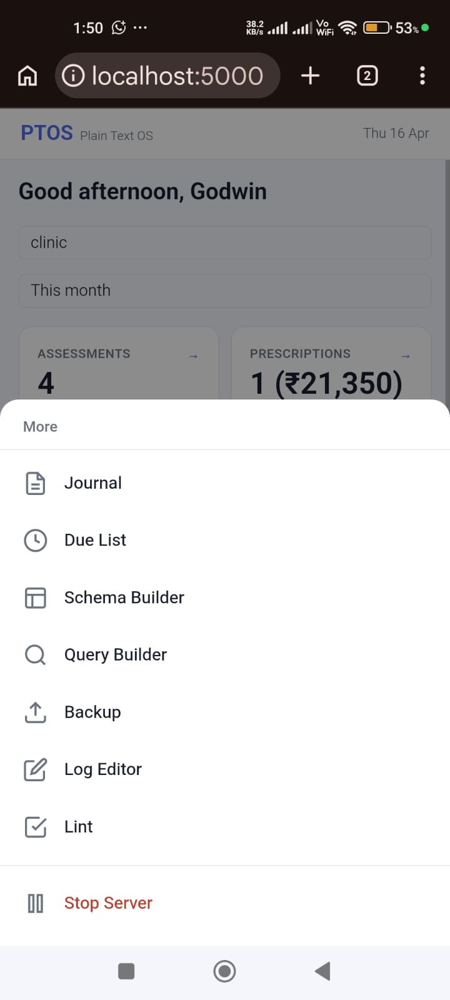

# Welcome to PTOS

PTOS is a personal record-keeping system. Log anything that matters — expenses,
income, exercise, or anything else you want to track — and search, filter, and report on it
whenever you need to.

Everything is stored as plain text files on your computer. No database, no internet,
no account. You own the data completely.

---

## Table of Contents

- [See it in action](#see-it-in-action)
- [The web app — your main interface](#the-web-app--your-main-interface)
- [How it works — the big picture](#how-it-works--the-big-picture)
- [The four config files](#the-four-config-files)
- [First time setup](#first-time-setup)
- [Where your data lives](#where-your-data-lives)
- [Things to know](#things-to-know)
- [Your data is safe](#your-data-is-safe)
- [The CLI — for advanced users](#the-cli--for-advanced-users)
- [Troubleshooting](#troubleshooting)

---

## See it in action

Real screenshots from a phone — this is what you open in your browser every day.

---

### Your dashboard — everything at a glance

Open PTOS and your numbers are right there. Income, expenses, investments, and balance
for the month — all in one view. Tap any card to drill into the records behind it.
Below the numbers, **Quick Add** presets let you log a frequent entry in a single tap.


---

### Add a record in seconds

Tap **+** at the bottom. The Add screen shows all your presets and record types
up front — one tap and the form opens pre-filled. No hunting through menus.


Once you pick a type, the form shows exactly the fields you need. Dropdowns are
pre-loaded with valid options. Tags appear as chips — tap to select, no typing needed.
The form even suggests your most-used values from history.


---

### Keep track of what's next

The **Todo** tab is a full todo list, following the todo.txt standard —
your tasks stay in a plain text file just like everything else in PTOS.
Add a task in plain language ("call the clinic tomorrow 3pm"), set a
priority, project, or due date, and PTOS reminds you when it's due.
Recurring tasks, quick filters by project or priority, and a proper
date/time picker are all built in.


---

### Run a saved report in one click

The **Queries** tab runs your saved reports. Pick a query, override the time
window (presets or specific year/month/date/range), and results appear instantly
— record count, total, average, and a full table. No typing filters every time.


---

### Filter and explore your records

**Browse** lets you slice your data any way you want. Tap a type chip to filter.
Active filters show as removable chips. A live preview shows exactly what query will
run before you execute it.


---

### Everything else is one tap away

Tap **More** at the bottom right to reach Search, Due List, Journal, Schema Builder,
Query Builder, Backup, Settings, Log Editor, and Lint — without cluttering the main navigation.



---

## The web app — your main interface

PTOS is designed to be used through a browser. Open it on your phone, tablet, or
desktop — no installation beyond the initial setup is needed.

The bottom navigation has five main sections. Everything else is one tap away
under **More**.

**Home** — your dashboard at a glance. Key metrics from your configured reports,
overdue items that need attention, and quick-add buttons for your saved presets.
Adjust the time window (presets or specific year/month/date/range) to see
metrics for any period.

**Queries** — run saved reports in one click. Pick a report, choose a time window
(this month, last month, a specific month / year / date / range, etc.), and results appear instantly.
No typing, no commands.

**Todo** — your task list. Add tasks in plain language ("call the clinic tomorrow 3pm"),
set priorities, projects, and due dates. Group tasks by Timeline, Priority, Project,
or Context with the toggle bar, and sort sections by name or task count.
Quick filters by project or priority, and a date/time picker built in.

**Browse** — filter and explore records. Pick a type, choose a time window
(presets or specific year/month/date/range), set filters, group or sort the
results, and export to CSV if you need to take the data elsewhere. Click any
row to open the edit form for that record.

**More** — everything else in one place:

- **Search** — universal search across records, todos, journal, and notes
- **Due List** — overdue items sorted by how long they have been waiting
- **Journal** — daily journal, one entry per day, navigate with Prev / Next or pick a date. Press **Save** when done — it does not save automatically
- **Notes** — organise notes by category (meetings, books, recipes, etc.) with live markdown preview
- **Schema Builder** — add or change record types without touching any files
- **Query Builder** — create custom queries, metrics, and reports with a visual builder
- **Settings** — currency, date format, dashboard layout, billing cycles, and backup preferences
- **Backup** — create, download, and restore backups
- **Lint** — check records for errors and list any issues
- **Log Editor** — view and edit the raw log file directly, only needed for corrections that cannot be made through Browse

For day-to-day use you only need **Home**, **Queries**, **Todo**, and **Browse**.

---

## How it works — the big picture

Think of PTOS as a logbook with rules.

You define **what kinds of things you want to track** (called *record types*) and
**what information each one should capture** (called *fields*). Those rules live in
one file called `schema.toml`. The app reads that file and builds the forms and
dropdowns automatically — you never have to touch any code.

Every record you save becomes one line in a plain text file:

```
2026-03-19 type=expense domain=home category=grocery amount=340 tag=vegetables | weekly veggies
```

Date first, then the type, then fields, then an optional note after the `|`.
Simple enough to read in Notepad, powerful enough to query and report on.

---

## The four config files

All the intelligence of PTOS lives in four small files inside the `config/` folder.
They are plain text — open any of them in Notepad and you will find clear comments
at the top explaining exactly how they work.

You rarely need to edit these files directly. The web app's Schema Builder, Browse,
and Queries tabs handle the most common changes through a visual interface.

### `schema.toml` — what you can record

This is the heart of the system. It defines every record type. PTOS ships with
example record types to get you started — personal finance types like expense and
income, and personal tracking types like exercise and learning. Each comes with
sensible field defaults you can adjust to suit your own life.

For each type, the schema defines which fields are required, what values each field
accepts, and which tags appear as checkboxes in the form. Use the **Schema Builder**
in the app to add or change record types — no file editing needed.

### `queries.toml` — your saved reports

Queries are saved filters and reports that you run repeatedly. Instead of setting
the same filters every time, you save them once with a name and run them in one click
from the Queries tab.

The file starts with one example query, one metric, and one dashboard. You can save
new queries directly from the Browse tab — set your filters, click **Save as Query**,
give it a name, and it appears in the Queries tab immediately.

### `presets.toml` — quick-add shortcuts

Presets are shortcuts for records you add frequently. A preset pre-fills the form
fields so you just confirm and save — no re-entering the same values every time.

Create presets directly from the Add Record form: fill in the fields, click
**Save as Preset** at the bottom, give it a name. Next time, pick it from the
**Load preset** dropdown at the top of the form.

Presets can also trigger multiple records at once — for example, a "morning routine"
preset that logs exercise, water intake, and medication in one tap. These
multi-presets are created by editing `presets.toml` directly rather than through
the Add Record form, and are listed separately under **Multi-presets** on the
Home screen.

### `config.toml` — basic settings

The main settings you will care about:

- **currency** — the symbol shown next to all money values (default: `₹`)
- **cycles** — custom billing or reporting periods, e.g. `billing_cycle = 26` starts a cycle on the 26th of each month
- **dashboard** — which dashboard shows by default on the Home screen
- **user.name** — your name, shown in the app header
- **editor** — which text editor opens when using the command line

The Settings tab in the app lets you change most of these without opening the file.

---

## First time setup

Download the script for your platform — it handles everything automatically:
installs dependencies, downloads PTOS from GitHub, and starts the web server.

**Windows** — download and double-click:

[`run_ptos.bat`](https://raw.githubusercontent.com/godwinburby/ptos/main/run_ptos.bat)

That's the only file you need — it downloads its companion script
and handles everything else automatically.

**Linux / macOS:**
```
curl -O https://raw.githubusercontent.com/godwinburby/ptos/main/run_ptos_linux.sh
bash run_ptos_linux.sh
```

**Android (Termux):**
```
curl -O https://raw.githubusercontent.com/godwinburby/ptos/main/run_ptos_android.sh
bash run_ptos_android.sh
```

After setup, use the same script to launch the web app (it checks for updates automatically):

| Platform | Run this |
|----------|----------|
| Windows | `run_ptos.bat` |
| Linux / macOS | `bash run_ptos_linux.sh` |
| Android (Termux) | `bash run_ptos_android.sh` |

Then open `http://localhost:5000` in your browser. On Android (Termux) the script
opens the browser automatically.

---

## Where your data lives

```
ptos/
├── records/
│   └── 2026.log          ← all your records for this year, one line per entry
├── todo/
│   ├── todo.txt          ← your active tasks
│   └── done.txt          ← completed tasks
├── journal/
│   └── 2026/
│       └── 2026-03-19.md ← today's journal entry
├── notes/
│   └── meeting/
│       └── 2026-03-19-standup.md ← a meeting note
├── config/
│   ├── schema.toml       ← record types and field rules
│   ├── queries.toml      ← saved reports and dashboards
│   ├── presets.toml      ← quick-add shortcuts
│   └── config.toml       ← currency, editor, billing cycles
└── exports/
    └── *.csv             ← exported reports (created on demand)
```

These are all plain text files. You can open any of them in Notepad.
Do not rename or move them — the app finds them by name and location.

---

## Things to know

**Nothing is automatic.** Records are added only when you press Save.

**Tags are optional but useful.** They let you cross-filter later — e.g. `tag=petrol`, `tag=morning`.

**The Note field is free text.** Use it for context the structured fields can't capture.
It goes after the `|` in the log line.

**Safety copies.** PTOS can create a backup automatically on startup and shutdown —
controlled by a setting in `config.toml`. If you need to undo a mistake, go to the
**Backup** tab to restore a previous version.

**Nothing leaves this computer.** All data stays local.

---

## Your data is safe

**Backups.** PTOS keeps up to 10 backups and can create them automatically on
startup and shutdown. Go to the **Backup** tab (under More) to create a manual
backup, download one to your device, or restore from a previous version.

**Plain text protection.** Even without a backup, your records are plain text files.
You can open them in any text editor, copy them to another device, or email them
to yourself at any time.

**Plain text.** Your records are just text files — no special software needed to read them.

---

## The CLI — for advanced users

The command-line interface (`ptos.py`) is the engine that powers everything. Most
users never need to use it directly — the web app handles all day-to-day tasks.

The CLI is useful when you want to:

- Add records quickly without opening a browser (`ptos --add ...`)
- Run complex ad-hoc analysis with grouping, pivots, and trends
- Script or automate record additions
- Use PTOS in a terminal-only environment (e.g. SSH, Termux without a browser)

Full CLI reference is in `README.md`.

---

## Troubleshooting

| Problem | What to try |
|---------|-------------|
| App won't open | Run `python3 ptos_web.py` directly to see error messages, or run `ptos --doctor`. |
| "schema.toml not found" | Run the setup script for your platform first. |
| A field or dropdown option is missing | Go to **More → Schema Builder** — add or edit the field there. |
| Record saved with wrong values | Go to **Browse** — find the record and click the row to open the edit form. |
| A query is missing or producing unexpected results | Go to **Browse**, set your filters, then click **Save as Query** to save. |
| Want to check for data errors | Go to **More → Lint**. |
| Need to restore a previous backup | Go to **More → Backup** — find your backup and click Restore. |
| Something looks broken and you can't figure it out | Don't change anything — reach out for help and describe what you saw. |

---

*For the full technical reference, see `README.md`.*
